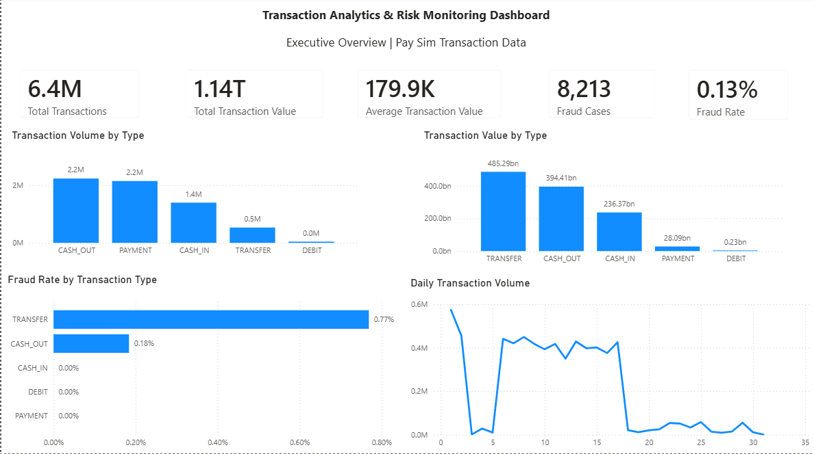
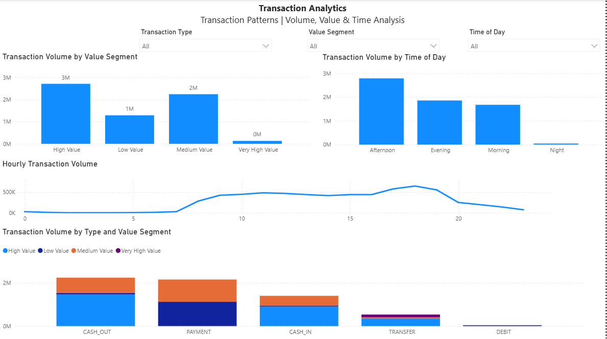
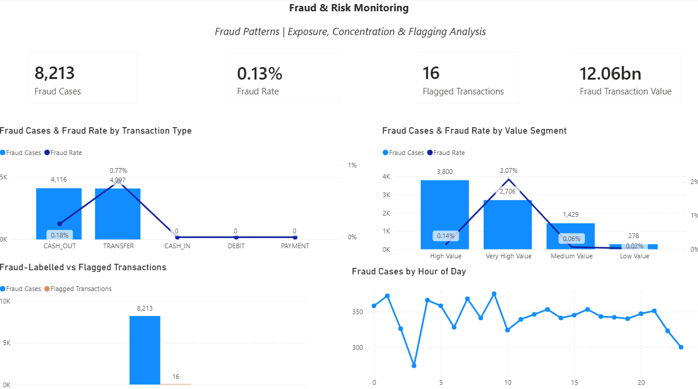
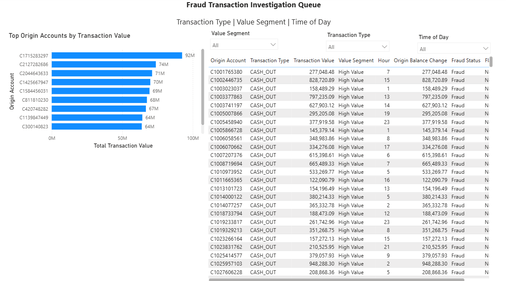

# Transaction Analytics & Risk Monitoring Dashboard

## Project Overview

This project demonstrates the design and development of a transaction analytics solution for a digital payments platform using MySQL and Power BI. The objective is to transform raw financial transaction data into actionable operational and risk insights that support business decision-making.
The solution analyzes over 6.3 million transactions from the PaySim dataset, providing visibility into transaction volumes, customer activity, payment trends, and fraud indicators through an interactive dashboard.

## Business Problem
Digital payment platforms process millions of financial transactions every day. Operations teams require timely insights into transaction activity, customer behavior, payment trends, and fraud indicators to support operational efficiency and risk management.
Manual reporting makes it difficult to identify transaction patterns, monitor platform performance, and detect unusual financial activity.
This project develops a centralized analytics solution that enables stakeholders to monitor transaction performance and risk through interactive reporting.

## Business Objectives
Monitor transaction activity
Analyze transaction value trends
Understand customer transaction behaviour
Evaluate fraud patterns
Build executive KPIs
Deliver interactive business intelligence

## Dataset
| Attribute      | Value                   |
| -------------- | ----------------------- |
| Dataset        | PaySim                  |
| Source         | Kaggle                  |
| Transactions   | 6,362,620               |
| Features       | 11                      |
| Missing Values | None                    |

| Granularity    | One row per transaction |
The analysis uses the [PaySim synthetic financial dataset](https://www.kaggle.com/datasets/ealaxi/paysim1).


## Tools

**SQL / SQLite**  
Data profiling, transformation, feature engineering, aggregation, reporting views, and metric validation.

**DBeaver**  
Database management and SQL development.

**Power BI**  
Data modeling, DAX measures, interactive analysis, dashboard development, and transaction-level investigation.

---

## Data Preparation

The raw transaction data contains 11 fields covering transaction type, amount, origin and destination accounts, account balances, fraud labels, and flag indicators.

I used SQL to create a prepared analytical view with additional fields for reporting, including:

- Simulation day and week
- Hour of day
- Time-of-day segment
- Transaction value segment
- Origin and destination balance movements
- Fraud status
- Flag status

Transaction amounts were grouped into four business-facing segments:

**Low Value | Medium Value | High Value | Very High Value**

The SQL layer also includes reporting views for transaction, time, account, KPI, and risk analysis.

---

## Dashboard

### Executive Overview



The Executive Overview provides a high-level view of transaction activity and fraud exposure.

It tracks total transaction volume, transaction value, average transaction value, fraud cases, and fraud rate, alongside transaction-type and daily activity trends.

---

### Transaction Analytics



This page explores how transaction activity is distributed across transaction types, value segments, and simulated time.

Interactive filters allow the analysis to be narrowed by **Transaction Type, Value Segment, and Time of Day**.

The page also compares transaction types against value segments, making it possible to see differences in transaction composition across CASH_OUT, PAYMENT, CASH_IN, TRANSFER, and DEBIT activity.

---

### Fraud & Risk Monitoring



The risk-monitoring page focuses on where fraud-labelled activity is concentrated.

Headline metrics include:

- **8,213** fraud-labelled transactions
- **0.13%** overall fraud rate
- **12.06B** in fraud-labelled transaction value
- **16** transactions marked by the dataset's flag indicator

Fraud is analyzed across transaction type, transaction value segment, and simulated hour.

---

### Fraud Transaction Investigation Queue



The investigation page moves from aggregated reporting to individual fraud-labelled transactions.

It provides visibility into the origin account, transaction type, transaction value, value segment, transaction hour, balance movement, fraud status, and flag status.

The queue can be filtered by transaction type, value segment, and time of day to support more focused analysis.

---

## Key Insights

### Fraud is concentrated in two transaction types

Fraud-labelled transactions occur exclusively within **CASH_OUT and TRANSFER** transactions in the dataset.

CASH_OUT accounts for **4,116 fraud cases**, compared with **4,097 for TRANSFER**.

The relative fraud exposure tells a different story:

| Transaction Type | Fraud Cases | Fraud Rate |
|---|---:|---:|
| CASH_OUT | 4,116 | 0.18% |
| TRANSFER | 4,097 | 0.77% |

Although the number of cases is almost evenly split, the fraud rate for TRANSFER transactions is substantially higher.

---

### Very High Value transactions carry the highest fraud rate

The relationship between transaction value and fraud also differs when looking at case volume versus fraud rate.

| Value Segment | Fraud Cases | Fraud Rate |
|---|---:|---:|
| High Value | 3,800 | 0.14% |
| Very High Value | 2,706 | 2.07% |
| Medium Value | 1,429 | 0.06% |
| Low Value | 278 | 0.02% |

High Value transactions account for the largest number of fraud cases, while **Very High Value transactions have the highest fraud rate at 2.07%**.

This makes the Very High Value segment particularly notable from a risk-monitoring perspective.

---

### Transaction volume does not tell the full value story

CASH_OUT and PAYMENT are the largest transaction types by volume, with approximately **2.2 million transactions each**.

Transaction value is distributed differently:

| Transaction Type | Transaction Value |
|---|---:|
| TRANSFER | 485.29B |
| CASH_OUT | 394.41B |
| CASH_IN | 236.37B |
| PAYMENT | 28.09B |
| DEBIT | 0.23B |

TRANSFER therefore represents the largest transaction value despite having significantly lower transaction volume than CASH_OUT or PAYMENT.

---

### Fraud-labelled transactions represent 12.06B in value

The **8,213 fraud-labelled transactions** account for approximately **12.06B** in transaction value.

Looking at fraud value alongside case counts and fraud rates provides a broader view of exposure than transaction frequency alone.

---

### Fraud labels and the flag indicator show a large difference

The dataset contains **8,213 fraud-labelled transactions**, while only **16 transactions** carry the `isFlaggedFraud` indicator.

The dashboard presents these separately because `isFlaggedFraud` represents a specific indicator within the PaySim simulation and is not treated as a complete measure of fraud detection performance.

---
### Power BI Report

The complete Power BI report is included in the repository and managed using Git LFS.

[View Power BI project file](powerbi/Transaction_Analytics_Dashboard.pbix)

## SQL Structure

The SQL work is organized into three scripts:

```text
sql/
├── 02_data_profiling.sql
├── 03_data_preparation.sql
└── 04_reporting_views.sql
02_data_profiling.sql

Explores the raw transaction data and establishes baseline metrics for transaction activity, value, account activity, and fraud.

03_data_preparation.sql

Creates the prepared transaction view used for analysis, including time features, transaction value segmentation, balance movements, and fraud-related fields.

04_reporting_views.sql

Creates reusable views for KPI, transaction, time, account, and risk reporting.

Power BI Measures

The dashboard uses DAX measures for dynamic analysis, including:

Total Transactions =
COUNTROWS(Transactions)

Total Transaction Value =
SUM(Transactions[amount])

Average Transaction Value =
AVERAGE(Transactions[amount])

Fraud Cases =
SUM(Transactions[isFraud])

Fraud Rate =
DIVIDE(
    [Fraud Cases],
    [Total Transactions],
    0
)

Flagged Transactions =
SUM(Transactions[isFlaggedFraud])

Fraud Transaction Value =
CALCULATE(
    [Total Transaction Value],
    Transactions[isFraud] = 1
)

These measures respond to the report's filter context and allow the same metrics to be analyzed across transaction type, value segment, and time.

Repository Structure
transaction-analytics-dashboard/
│
├── README.md
│
├── sql/
│   ├── 02_data_profiling.sql
│   ├── 03_data_preparation.sql
│   └── 04_reporting_views.sql
│
├── powerbi/
│   └── Transaction_Analytics_Dashboard.pbix
│
├── images/
│   ├── executive_overview.png
│   ├── transaction_analytics.png
│   ├── fraud_risk_monitoring.png
│   └── investigation_queue.png
│
└── documentation/
    └── data_dictionary.md

The source transaction file and local SQLite database are excluded from the repository because of their size.

Skills Demonstrated

SQL

Data profiling and validation
Data transformation
CASE-based segmentation
Feature engineering
Aggregation
Analytical views

Power BI

Data modeling
DAX measures
KPI reporting
Interactive filtering
Data visualization
Dashboard design

Business Intelligence

Transaction performance analysis
Risk monitoring
Metric reconciliation
Analytical segmentation
Investigation-focused reporting
Translating transaction data into business insights
